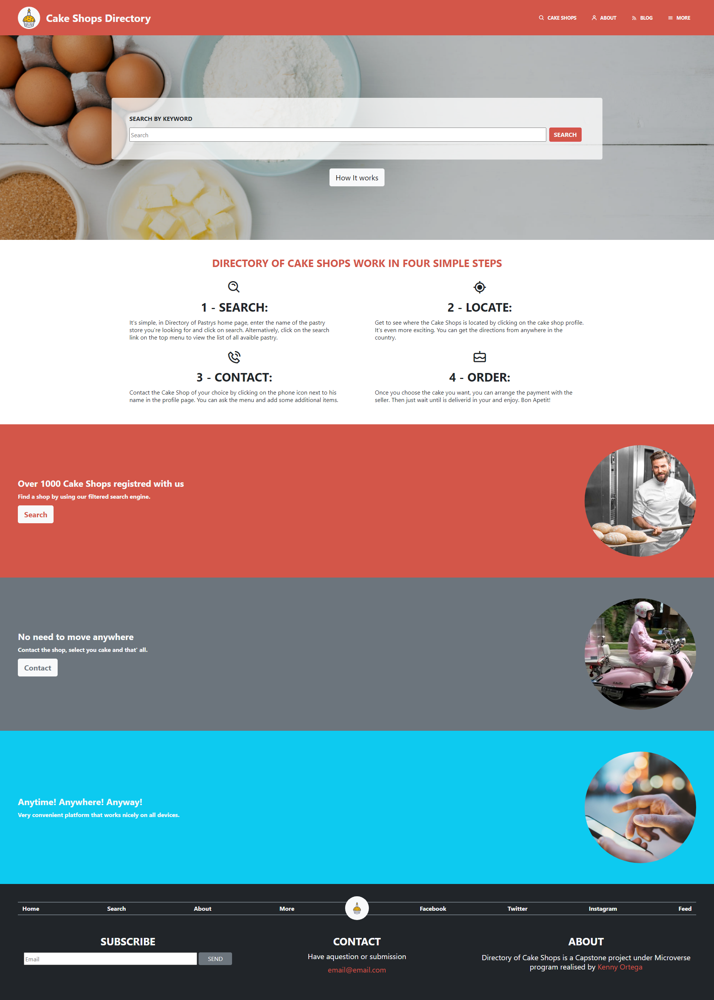
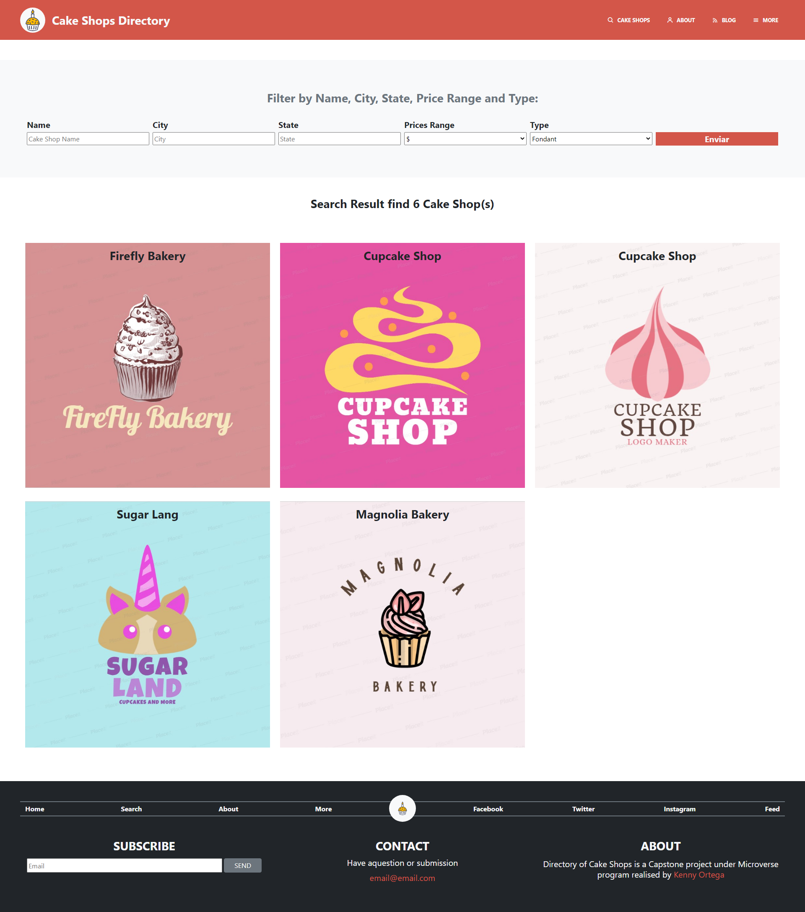
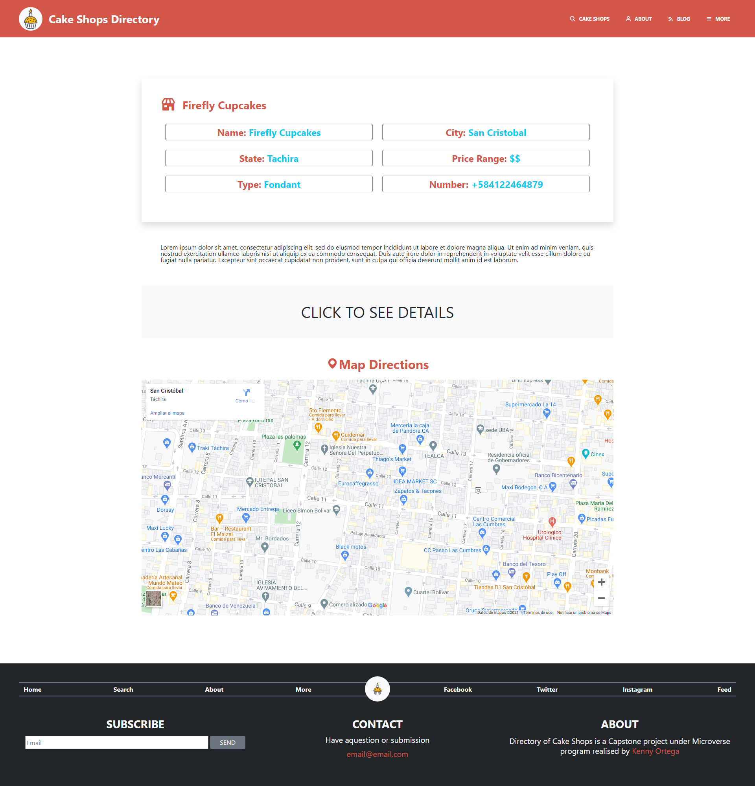

# Cake Shops

 ## This page is my Capstone project for the Microverse's HTML and CSS course curriculum. The design was inspired on the work of [Mathew Njuguna](https://www.behance.net/mathewnjuguna) and others on Behance, specially this project: [patashuleke](https://www.behance.net/gallery/25563385/PatashuleKE).

#### The original design is a Directory of Schools, but we are encouraged to change the theme to a different one, so I went ahead and created a site that helps people to find the perfect Cake Shop.

### Main Page

##### This page is meant to allow the user to search for cats or shelters using keywords. If he or she doesn't know how to navigate the site, there's a button just below the search bar that'll scroll down, taking the user to a part of the website that explains everything.

### Search Result Page

#### This page shows the results of a search made by keywords in the main page, or by categories in this same page. You can search by name of shelter, or by characteristic of the cat you're looking for.

### Detail Page

##### This page show the detail info from the Cake Shop with phone number, range of prices, type, city, state and phone number.

### Built with
    HTML5
    CSS3
    Bootstrap

## Getting Started

To get a local copy up and running follow these simple example steps.

### Prerequisites

- Have a compatible web browser that supports HTML5 and CSS3 in order to correctly display the website.
- A text editor in order to view and edit code. Popular text editors include VSCode and Notepad++.

### Setup

On GitHub bash 
    _git clone https://github.com/kensayo/TNW-wk2.git_

### Usage

- Most Operative Systems have the .html file extension associated to open with your default web browser. In order to review the code, you may use your web browser inspect element option or open directly with a text editor.

- In the cloned folder access to
    _index.html_

## 👤 Kenny Ortega

- GitHub: [kensayo](https://github.com/kensayo)
- Twitter: [@kensayo](https://twitter.com/kensayo)
- LinkedIn: [LinkedIn](https://www.linkedin.com/in/kenny-ortega-3580aa33/)

### Check it online!

 # [Live Preview](https://kensayo.github.io/Bakers-Directory/)

### The specifications of the project were as follows:

#### 1- This is a real-world-like project with a design made by a professional. 
I didn't have an exact page to just inspect the code and have tips of how to build it; I had only the design to be inspired upon. I was expected to select, with my own knowledge, the proper technologies and techniques to achieve the business specifications.

#### 2- I had to create three pages: 
- the main page (search page), with a link to the results page.
- the search results page, with a list of schools (or, in this case, cake shops) each with a link to the detail page.
- the detail page.

#### 3- Each of these pages should have versions for 3 different screen sizes: 

- mobile: up to 768px
- tablet: up to 1024px
- desktop: from 1024px

#### 4- I had to follow the guidelines of the given design, including:

- colors (they are not explicitly in the design, but I could pick them from the design page)
- typographies: font face, size and weight (I could use a similar one given on the design)
- layout: composition and space between elements, for the 3 given screen sizes;

### Contributions and issues are welcome!

License
This project is MIT licensed.
